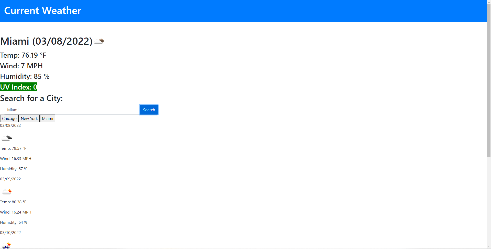

# weather-dashboard

The purpose of this website is to display data from a weather api about a certain area's forecast.

## Table of Contents
1. [Built With](#built-with)
2. [Visual](#visual)
3. [Contributors](#contributors)

## Built With

This was built with [Bootstrap 4.6.1](https://getbootstrap.com/docs/4.6/getting-started/introduction/), [Moment.js](https://momentjs.com/), and [Open Weather Map API](https://openweathermap.org/api).

## Website Link

https://rich-afk.github.io/weather-dashboard/

## Visual

## Contributors

I'd like to give a big thank you to Juan Delgado, my TA.

## My Contact

r.c.kim3@gmail.com